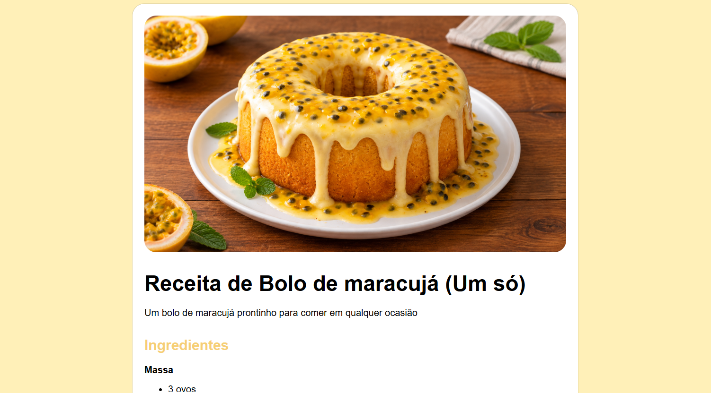

# Pagina-de-Receita

  <strong>Um projeto desenvolvido para praticar e consolidar fundamentos de HTML e CSS.</strong>

  

---

## Sobre o projeto

Este projeto consiste em uma página web de receita de **bolo de maracujá**, desenvolvida como parte dos meus primeiros estudos em desenvolvimento Front-End.

O objetivo principal foi colocar em prática conceitos fundamentais de **HTML5 e CSS3**, trabalhando estrutura semântica, tipografia, organização de conteúdo, tabelas e responsividade.

## Tecnologias utilizadas

- HTML5
- CSS3
- Flexbox
- CSS `@font-face`
- Tipografia responsiva com `clamp()`
- Tabelas HTML
- HTML semântico

## O que pratiquei

Durante o desenvolvimento, trabalhei principalmente com:

- Estruturação de páginas utilizando HTML semântico;
- Criação e estilização de tabelas;
- Utilização de fontes personalizadas com `@font-face`;
- Responsividade através de unidades relativas;
- Uso de `clamp()` para adaptação do tamanho dos textos;
- Organização de conteúdo com listas e seções;
- Construção de layouts utilizando Flexbox;
- Separação entre estrutura HTML e estilização CSS.

## Preview

  

## Próximos passos

Este projeto representa uma das etapas iniciais da minha jornada no Front-End.

A ideia é continuar evoluindo gradualmente, avançando de projetos focados em **HTML e CSS** para interfaces mais interativas utilizando **JavaScript**, APIs e outras tecnologias do desenvolvimento web.

## Desafio

O projeto foi inspirado no desafio **Recipe Page** da Frontend Mentor.

## AI Collaboration

Durante o desenvolvimento, utilizei inteligência artificial como ferramenta de apoio aos estudos, principalmente para tirar dúvidas, compreender conceitos de HTML/CSS e revisar decisões de implementação.

A implementação e as decisões finais do projeto foram realizadas como parte do meu processo de aprendizagem.

## Autor

**Mateus**

Estudante de Ciência da Computação e desenvolvedor em formação, atualmente focado em construir uma base sólida em desenvolvimento Front-End.

---

  <i>Primeiros projetos. Aprendizado constante. Evolução contínua.</i>

